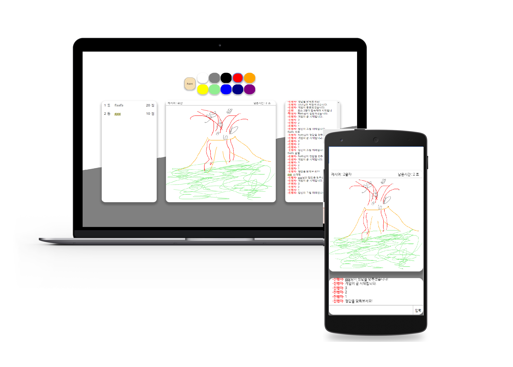

내가그린 기린그림 
========================
그림 퀴즈 게임 클론 프로젝트
-----------------------------

</img>

> 게임 플레이하기!
> >* __FE 주소 : <https://priceless-hoover-994589.netlify.app/>__   
> > 위 주소로 접속하면 게임을 즐길수 있습니다.   
>> __플레이 방법__   
>> 1. 최소 2명이 위 링크로 접속한다.   
>>   (혼자서 플레이 해보시고 싶으시다면 2개의 브라우저로 접속해주세요.)   
>>  (ex. 크롬 - 엣지 / 크롬 - 크롬 시크릿 탭)
>> 2. 매 라운드 랜덤으로 화가가 선택되고, 화가는 제시어를 그림으로 설명합니다
>> 3. 나머지 사람들은 채팅창으로 정답을 맞추고, 점수를 얻습니다.
>>> 화가는 채팅을 칠수 없습니다. :(   
>>> PC - 모바일간 플레이도 가능합니다!   
>>> 갤럭시S8, 아이폰6 환경에서 모바일 구동 확인했습니다. :)   
>>> 모바일페이지 접속자는 스코어보드를 보실수 없습니다 :(   
>>> 단어 난이도는 매우 쉽습니다 :)   
>>> 제작자의 첫 프로젝트이므로 버그가 많습니다 :(   
>>> BE 주소 : <https://paintgame-backend.herokuapp.com/>(사실 의미 없는 주소)

프로젝트 설명
------------
>제 개인 프로젝트로는 첫 작품입니다.  
>무료API(날씨, 영화)를 이용하여 사이트를 제작하는 단계에서 한단계 성장하기위해   
>소켓 통신을 이용한 프로젝트를 진행해봤습니다.   
>프론트 서버는 React를 이용하여 만들었고, 백엔드 서버는 Express로 만들었습니다.   
>프론트와 백엔드사이에는 소켓통신을 사용하여 데이터를 주고받습니다.

프로젝트 진행중 어려웠던 부분
----------------------------
>1. 강의만 보다가 직접 코드를 작성해보니 처음부터 끝까지 다 어려웠음...   
>2. 컴포넌트를 용도별로 쪼개고, 모듈화하며 코드를 작성하는부분 및 디자인 패턴 에서 이해도가 많이 부족함을 느낌.   
>3. 처음부터 모바일 페이지를 고려하고 만든 프로젝트가 아니었기때문에, 모바일 페이지를 미디어 쿼리로 처리하던중 코드가 지저분해짐(다음 프로젝트부턴 기획을 잘해야겠다...)   
>4. 모바일 기기마다 다른 해상도, 다른 브라우저를 사용하기때문에 발생하는 문제를 처음 직면했음.

다음 프로젝트 계획
------------------
>1. 백엔드 서버를 단순 소켓통신만 하는 역할이 아닌 그리는 사람, 맞추는 사람들의 유저 데이터를 저장할수있게 DB도 붙여서 확장할 계획.   
>2. 1:N게임이 아닌 다른사람이 출제한 문제를 맞추는 등의 싱글플레이 컨텐츠도 추가 예정   
>3. 페이지에 광고를 추가하여 사이트 수익화 방안도 고려중.
>4. 모바일 레이아웃에 대해 구조를 다시 설계할 필요가 있음.
>5. UX설계고려를 위해 지인들에게 사이트를 배포할 계획.